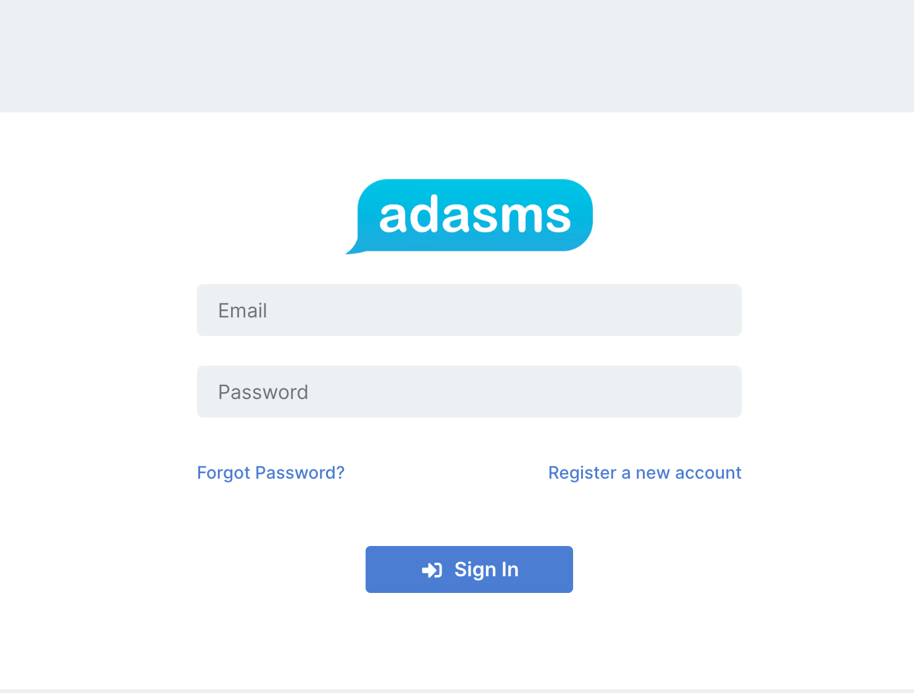
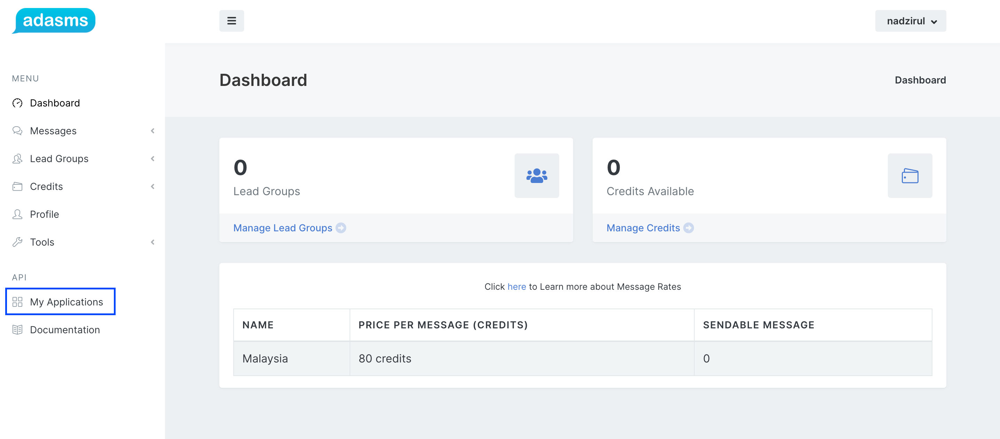
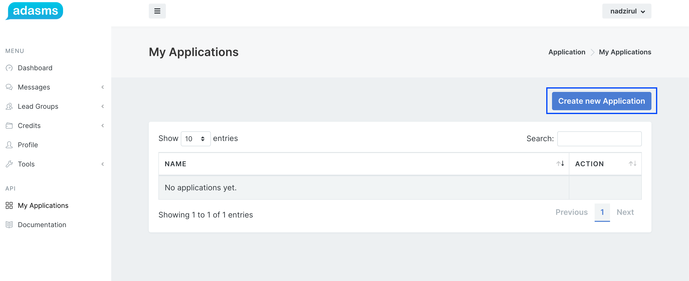
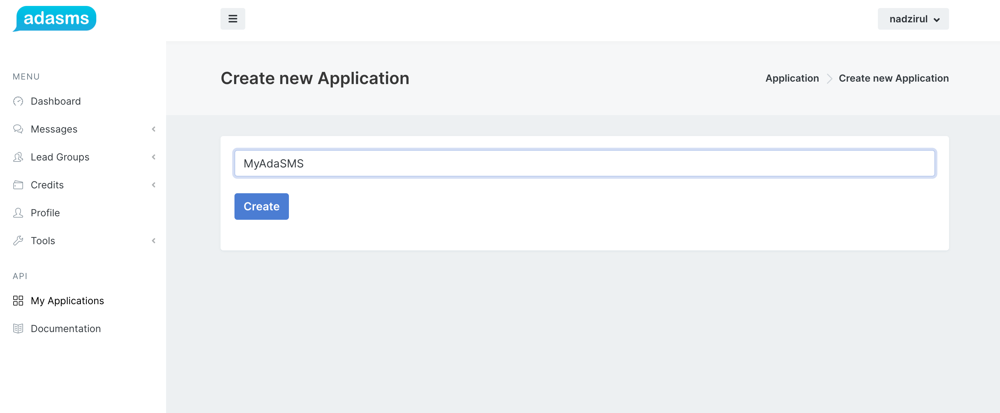
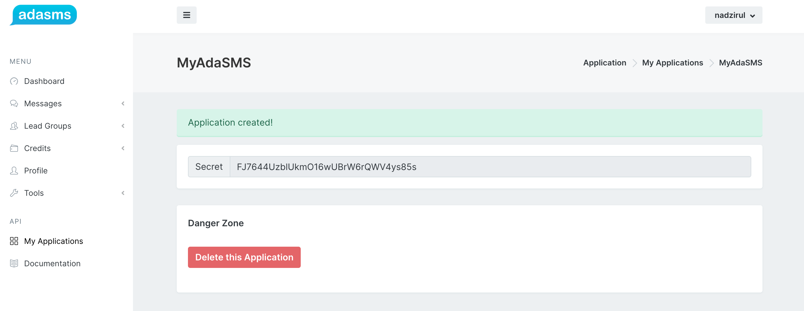
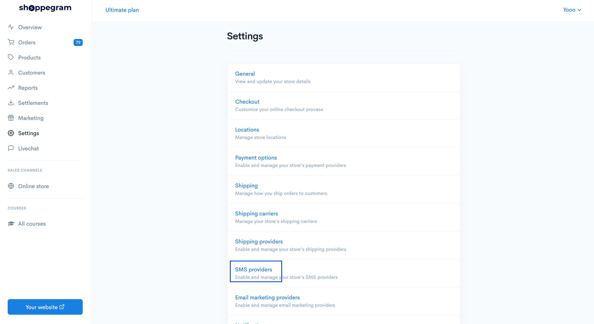
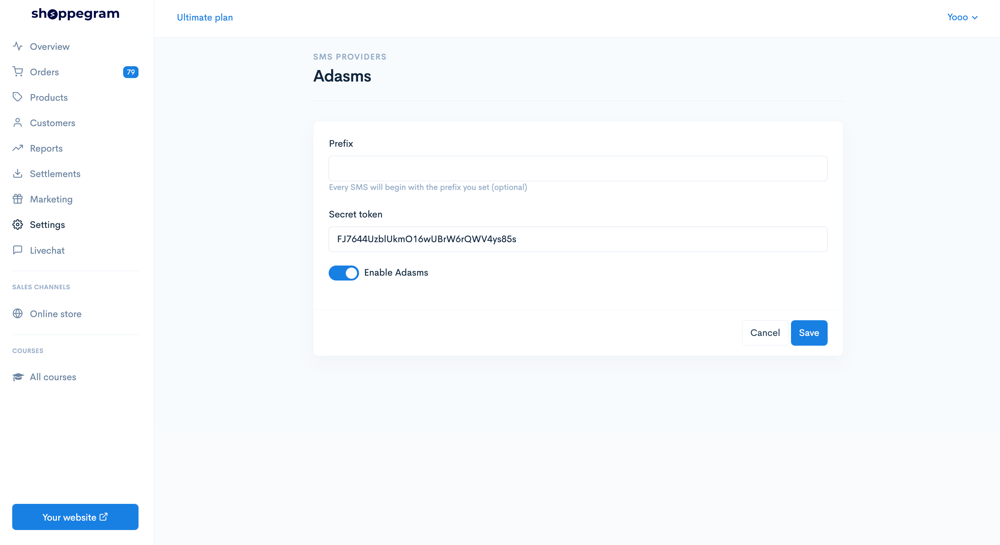

# AdaSMS

Untuk penetapan SMS Notification menggunakan sistem AdaSMS anda boleh ikut langkah yang telah disediakan ini.&#x20;

**Sebelum memulakan penetapan ini, anda perlu pastikan anda sudah daftar akaun AdaSMS dan membuat penetapan SMS message yang anda ingin hantar kepada pelanggan anda.** [**https://terminal.adasms.com/register**](https://terminal.adasms.com/register)

1. Log masuk ke akaun AdaSMS anda. <https://terminal.adasms.com/login>

2\. Pada dashboard **AdaSMS** , klik pada menu **My Applications**.

3\. Seterusnya, klik pada **Create new Application**.

4\. Masukkan sebarang nama pada ruangan ini dan klik butang **create.**

5\. Paparan seperti dibawah akan muncul. **Copy secret key anda**.

## **PENETAPAN PADA COMMERCE**.

1. Pada akaun commerce anda. Klik pada butang **settings** dan pilih **SMS providers**

2\. Pada ruangan ini, anda boleh **kosongkan ruangan Prefix** dan **masukkan secret key yang ada cipta pada AdaSMS pada ruangan Secret token**. Klik **enable AdaSMS** dan **Save**.

Setelah selesai anda boleh cuba membuat pembelian di website anda dan lihat hasilnya sendiri.
