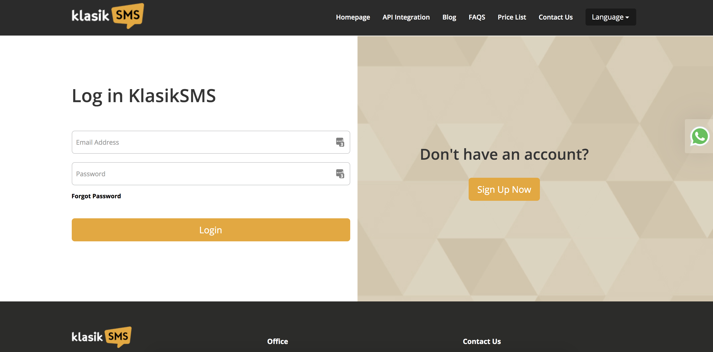
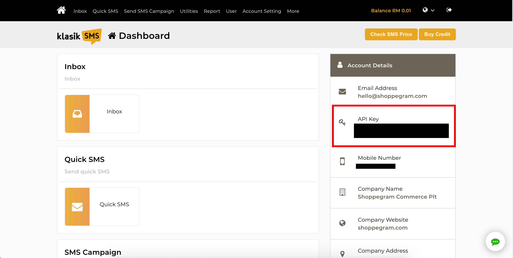
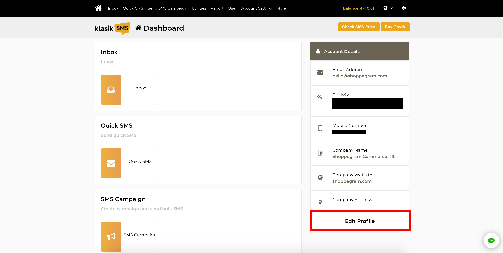
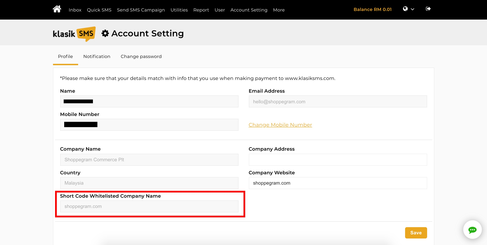
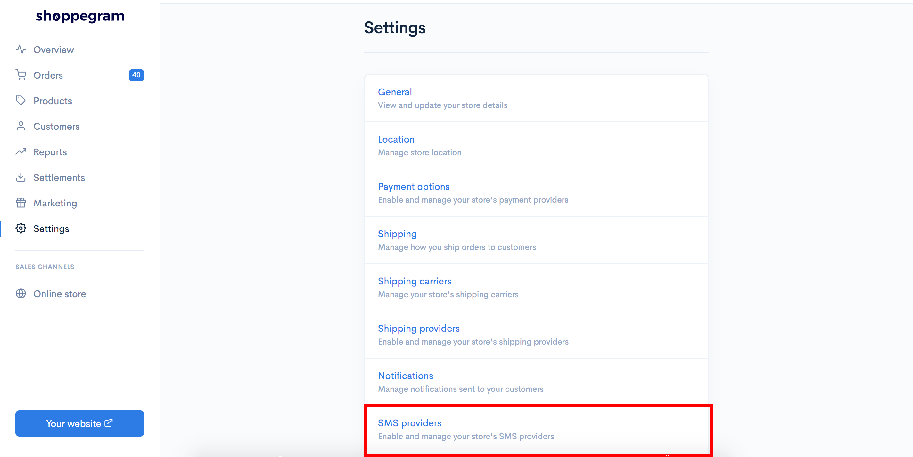
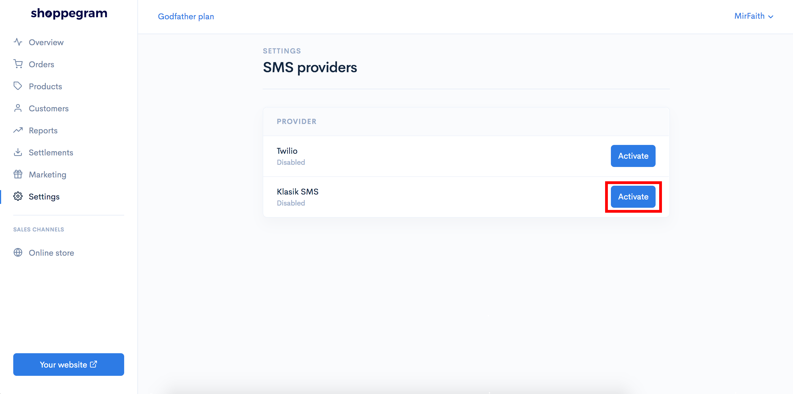
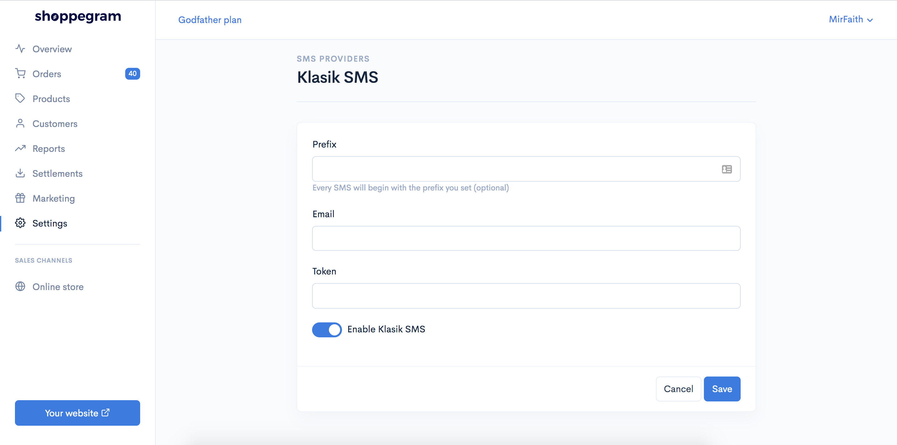
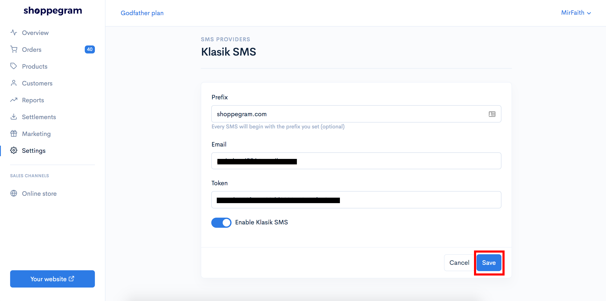

# KlasikSMS

Untuk penetapan SMS Notification menggunakan sistem Klasik SMS anda boleh ikut langkah yang telah disediakan ini.&#x20;

**Sebelum memulakan penetapan ini, anda perlu pastikan anda sudah daftar akaun Klasik SMS dan membuat penetapan SMS message yang anda ingin hantar kepada pelanggan anda. Pastikan  juga anda sudah membuat template notifikasi pada akaun KlasikSMS anda.**

## **Pengumpulan maklumat Klasik SMS**

1\. Log masuk ke akaun Klasik SMS anda

2\. Di dashboard Klasik SMS anda perlu dapatkan maklumat :

* **Api key/Auth token**

3\. Seterusnya anda perlu klik pada **Edit Profile**&#x20;

4\. Di halaman tersebut anda perlu simpan maklumat **Short Code Whitelisted Company Name** untuk kegunaan langkah seterusnya.**(Jika pada ruangan tersebut kosong anda perlu topup kredit terlebih dahulu didalam akaun Klasik SMS anda)**

**\*\* Kedua-dua maklumat tersebut anda perlu simpan untuk kegunaan pada langkah seterusnya.**

## Penetapan di Commerce

1\. Log masuk ke akaun Commerce

2\. Klik pada tab **Settings**

3\. Klik pada tab **SMS providers**

4\. Klik butang **Activate** pada tab **Klasik SMS**

5\. Masukkan maklumat yang anda sudah simpan tersebut pada ruangan yang telah disediakan. Untuk ruangan prefix anda boleh masukkan text **Short Code Whitelisted Company Name** yang anda baru copy pada langkah sebelum ini.&#x20;


Anda juga perlu pastikan anda sudah klik **Enable Klasik SMS( Pastikan ia bewarna biru ).**


6\. Setelah selesai anda boleh klik **Save**.

Setelah selesai anda boleh cuba membuat pembelian di website anda dan lihat hasilnya sendiri.
