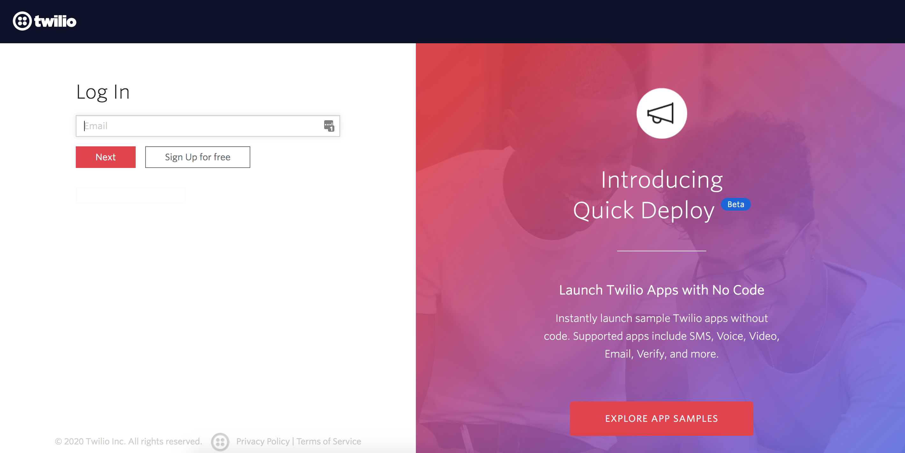
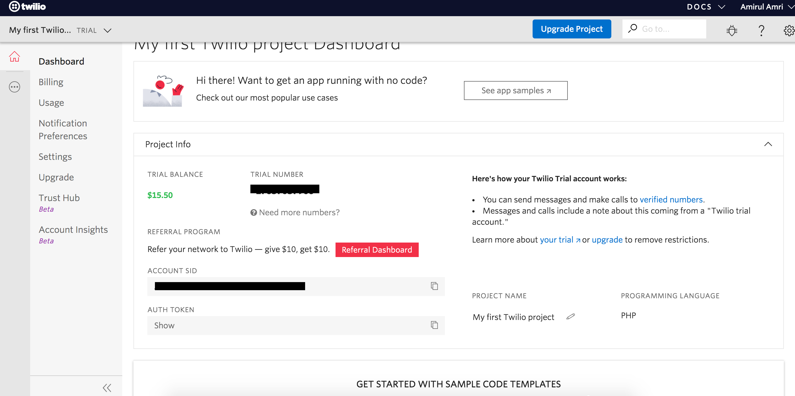
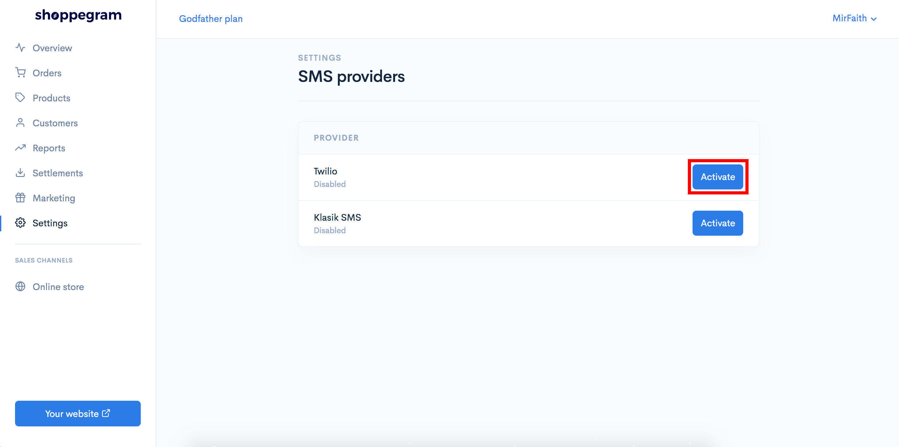
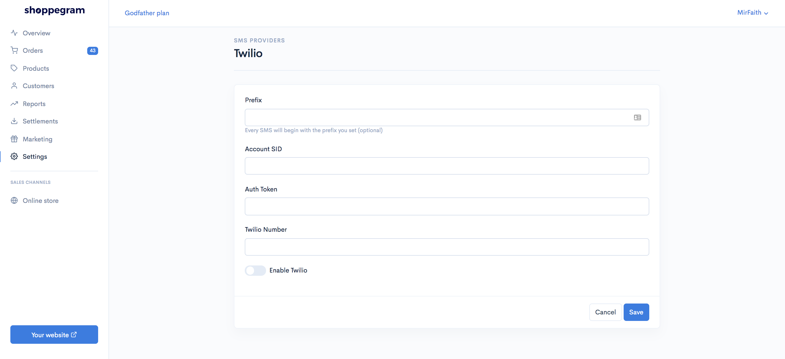
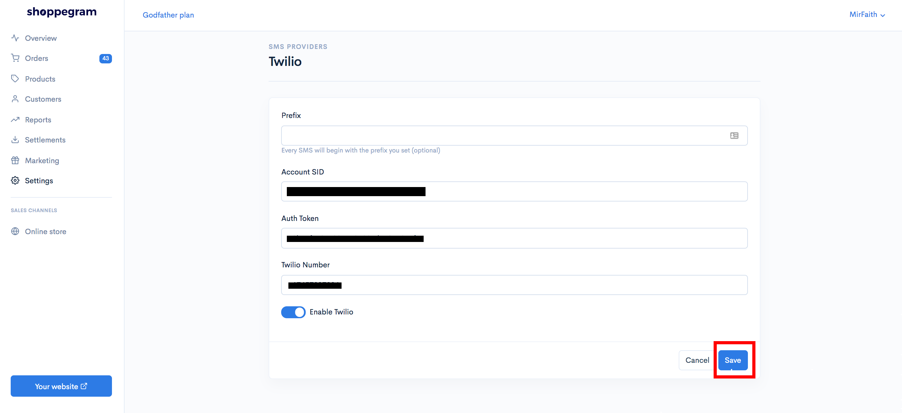

# Twilio

Untuk penetapan SMS Notification menggunakan sistem Twilio anda boleh ikut langkah yang telah disediakan ini.&#x20;

**Sebelum memulakan penetapan ini, anda perlu pastikan anda sudah daftar akaun Twilio dan membuat penetapan SMS message yang anda ingin hantar kepada pelanggan anda.**

## **Pengumpulan maklumat Twilio**

1\. Log masuk ke akaun Twilio anda

2\. Di dashboard Twilio anda perlu dapatkan maklumat :

* **Account SID**
* **Auth token**
* **Twilio number ( Jika anda tidak mempunyai maklumat ini, anda boleh dapatkan twilio number ini dengan klik pada button Get number )**&#x20;

**\*\* Ketiga - tiga maklumat tersebut anda perlu simpan untuk kegunaan pada langkah seterusnya.**

## Penetapan di Commerce

1\. Log masuk ke akaun Commerce

2\. Klik pada tab **Settings**

3\. Klik pada tab **SMS providers**

4\. Klik butang **Activate** pada tab Twilio

5\. Masukkan ketiga - tiga maklumat yang anda sudah simpan tersebut pada ruangan yang telah disediakan. ( **Untuk ruangan Prefix anda boleh biarkan ia kosong** ) . **Anda juga perlu pastikan anda sudah klik Enable Twilio ( Pastikan ia bewarna biru )**.

6\. Setelah selesai anda boleh klik **Save**.

Setelah selesai anda boleh cuba membuat pembelian di website anda dan lihat hasilnya sendiri.
