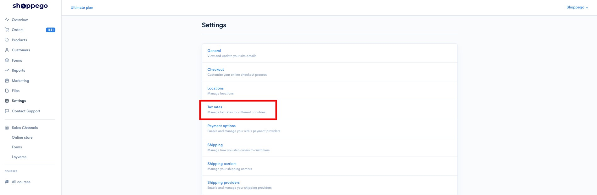
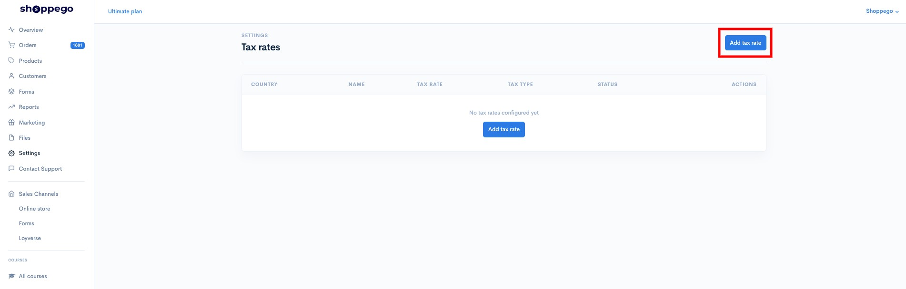
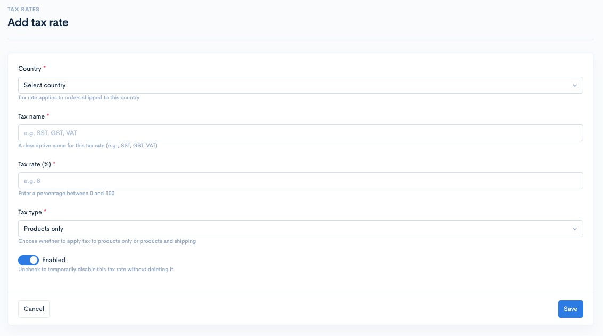
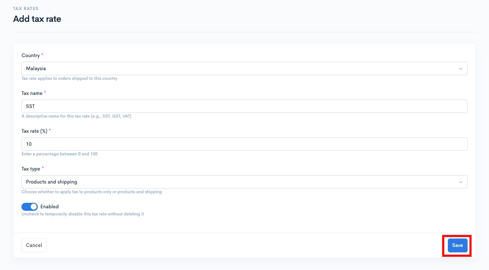
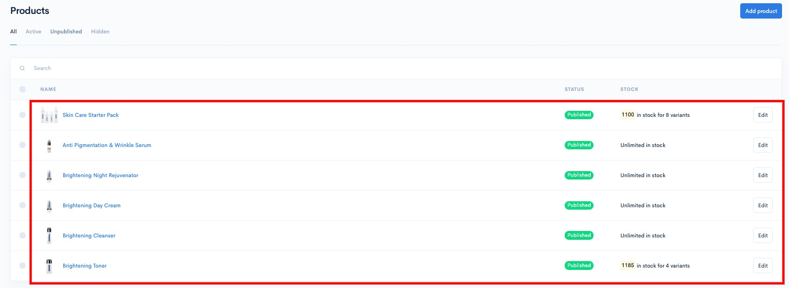
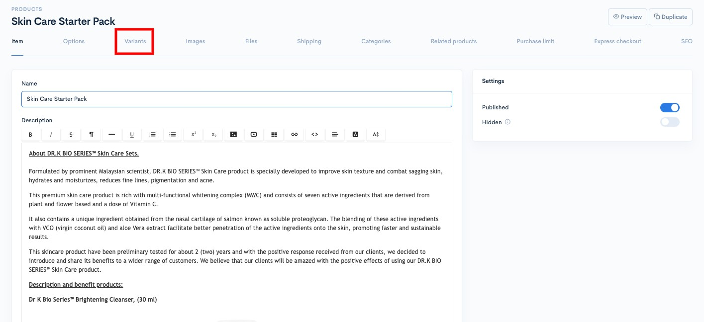
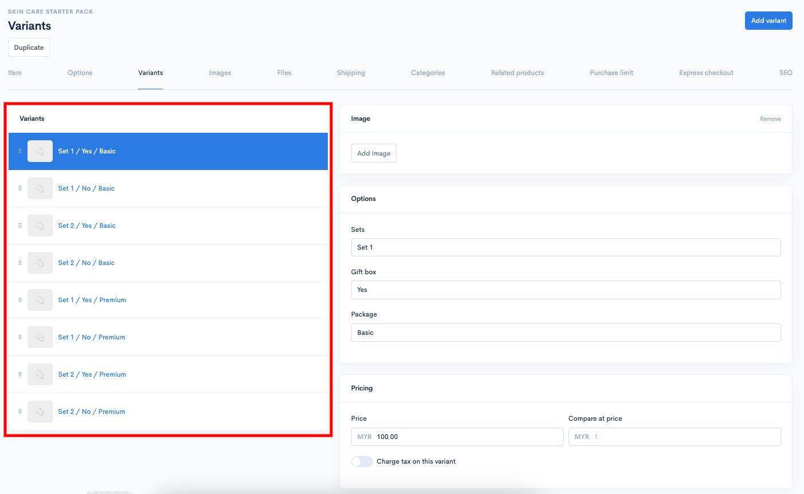
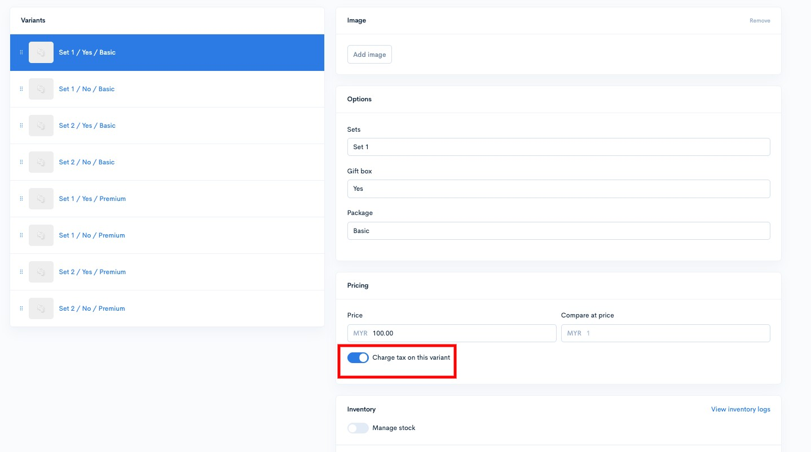
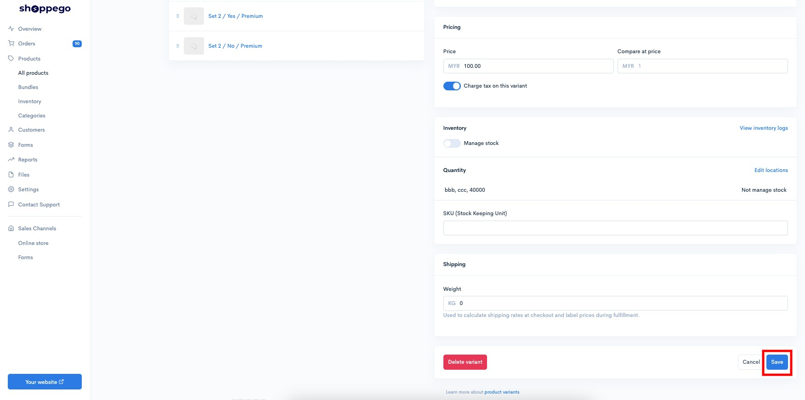

# Tax Rates

Di Shoppego, anda sudah boleh lakukan penambahan caj cukai kepada pelanggan anda untuk setiap pembelian mereka.

## Cipta Tax Rate

Untuk lakukan penetapan ini, anda boleh pergi pada bahagian:

1. Log masuk akaun Shoppego

<figure><figcaption></figcaption></figure>

2. Klik pada **Settings**

<figure><figcaption></figcaption></figure>

3. Klik pada **Tax rates**

<figure><figcaption></figcaption></figure>

4. Klik pada butang **Add tax rate**

<figure><figcaption></figcaption></figure>

5. Seterusnya, anda boleh lakukan penetapan untuk info-info cukai anda.

<figure><figcaption></figcaption></figure>

| Parameter    | Penerangan                                                                                                                                                       |
| ------------ | ---------------------------------------------------------------------------------------------------------------------------------------------------------------- |
| Country      | Anda boleh pilih negara yang anda ingin kenakan cukai ini.                                                                                                       |
| Tax name     | Anda boleh masukkan nama untuk cukai yang anda kenakan ini. Sebagai contoh SST, GST, etc.                                                                        |
| Tax rate (%) | Anda boleh masukkan peratusan cukai yang anda akan kenakan.                                                                                                      |
| Tax type     | Anda boleh lakukan pemilihan untuk kenakan cukai ini mengikut jumlah harga pembelian produk sahaja(Products only) atau produk + shipping(Products and shipping). |
| Enabled      | Anda boleh tick(Enabled) atau untick(Disabled) toggle ini untuk aktifkan atau nyah-aktifkan cukai ini.                                                           |

6. Setelah selesai, klik **Save**

<figure><figcaption></figcaption></figure>

**Seterusnya, anda perlu lakukan penetapan cukai itu pada produk yang anda ingin kenakan cukai.**

## Penetapan cukai pada produk

1. Log masuk akaun Shoppego

<figure><figcaption></figcaption></figure>

2. Klik pada **Products**

<figure><figcaption></figcaption></figure>

3. Klik pada produk yang anda ingin kenakan cukai.

<figure><figcaption></figcaption></figure>

4. Klik pada tab **Variants**

<figure><figcaption></figcaption></figure>

5. Seterusnya, anda perlu klik pada **pemilihan variants** yang anda ingin kenakan cukai tersebut.

<figure><figcaption></figcaption></figure>

6. Tick pada toggle **Charge tax on this variant**

<figure><figcaption></figcaption></figure>

7. Setelah selesai, klik **Save**

<figure><figcaption></figcaption></figure>

**Kemudian, anda boleh ulang** [**langkah ini**](tax-rates.md#penetapan-cukai-pada-produk) **untuk pemilihan variants dan produk yang lain juga yang anda ingin kenakan cukai.**
