# Resend

Resend adalah sebuah platform penghantaran emel. Ia membolehkan anda menghantar notifikasi email anda menggunakan domain anda yang tersendiri.

Untuk integration dengan platform Resend anda boleh rujuk tutorial yang disediakan ini.

## Sebelum Anda Memulakan:

* Pastikan anda sudah mempunyai domain anda yang tersendiri
* Pastikan anda mempunyai akses untuk lakukan penetapan DNS record pada domain anda itu
* Pastikan anda sudah lakukan pendaftaran akaun Resend

## Penambahan Domain

1. Log masuk akaun Resend

<figure><figcaption></figcaption></figure>

2. Klik pada **Domains**

<figure>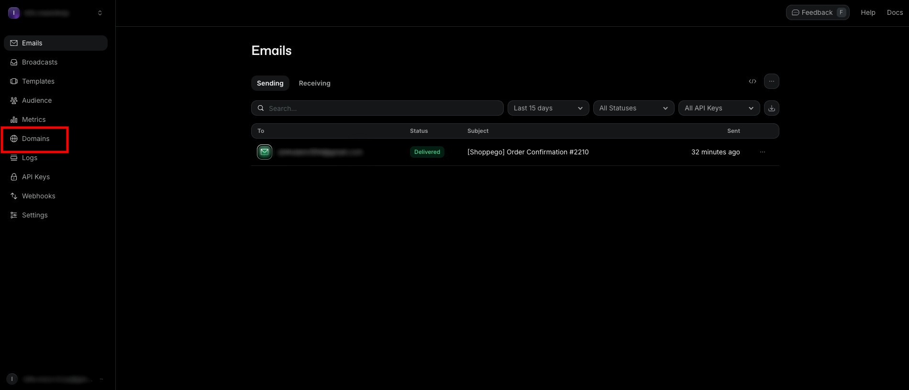<figcaption></figcaption></figure>

3. Klik **Add domain**

<figure>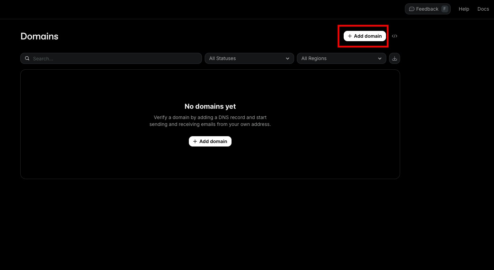<figcaption></figcaption></figure>

4. Kemudian, anda boleh **masukkan nama domain anda** dan untuk penetapan "**Region**" anda boleh pilih "**Tokyo (ap-northeast-1)**". Setelah selesai klik Add domain

<figure>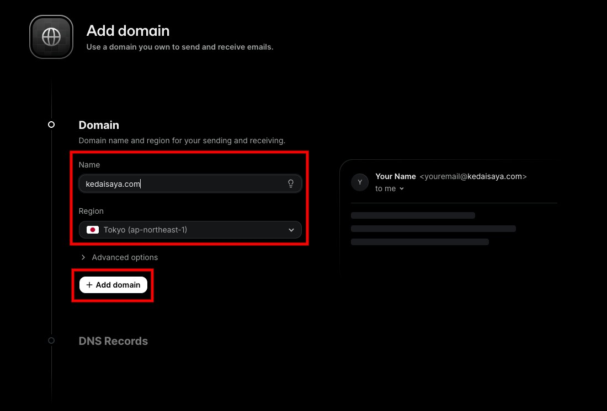<figcaption></figcaption></figure>

### Verify domain

1. Seterusnya, anda perlu lakukan verify domain tersebut.

<figure>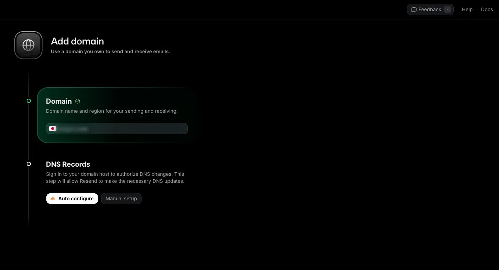<figcaption></figcaption></figure>

2. Sekiranya, anda lakukan pengurusan domain anda itu di **Cloudflare**, anda boleh terus klik "**Auto configure**". Untuk **platform yang lain**, anda perlu lakukan **Manual setup**.\
   \
   Untuk tutorial ini, kami akan terus lakukan penetapan secara "**Manual setup**".

<figure>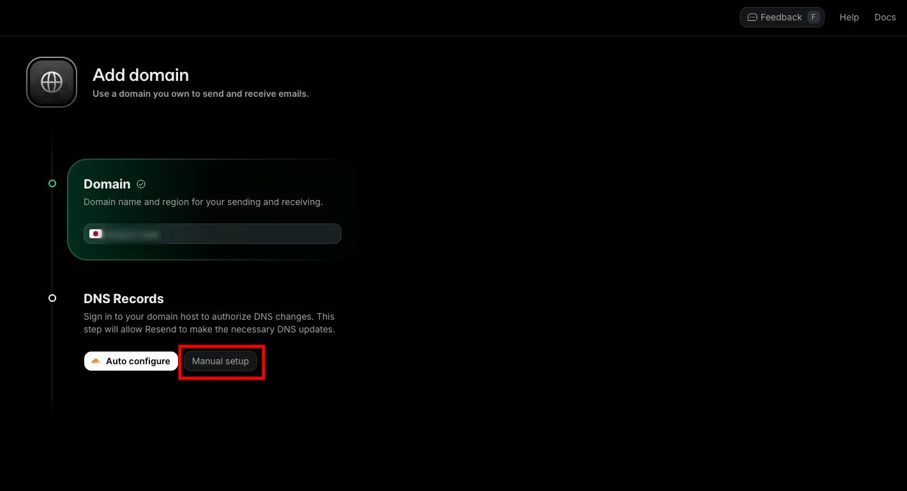<figcaption></figcaption></figure>

3. Kemudian, anda perlu ikuti kesemua penetapan yang mereka minta untuk lakukan pada DNS record domain anda itu. Anda hanya perlu lakukan penetapan "**Domain Verification**" dan "**Enable Sending**" sahaja.

<figure>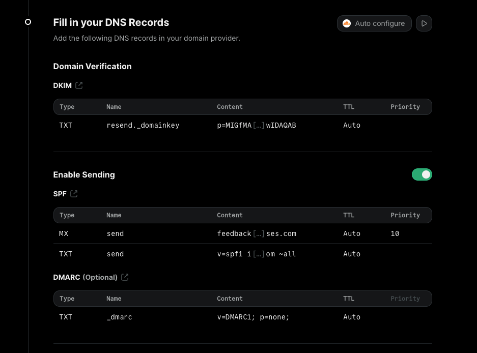<figcaption></figcaption></figure>

4. Anda boleh klik pada "**Forward instruction**" di bahagian bawah dan **masukkan email** anda.

<figure>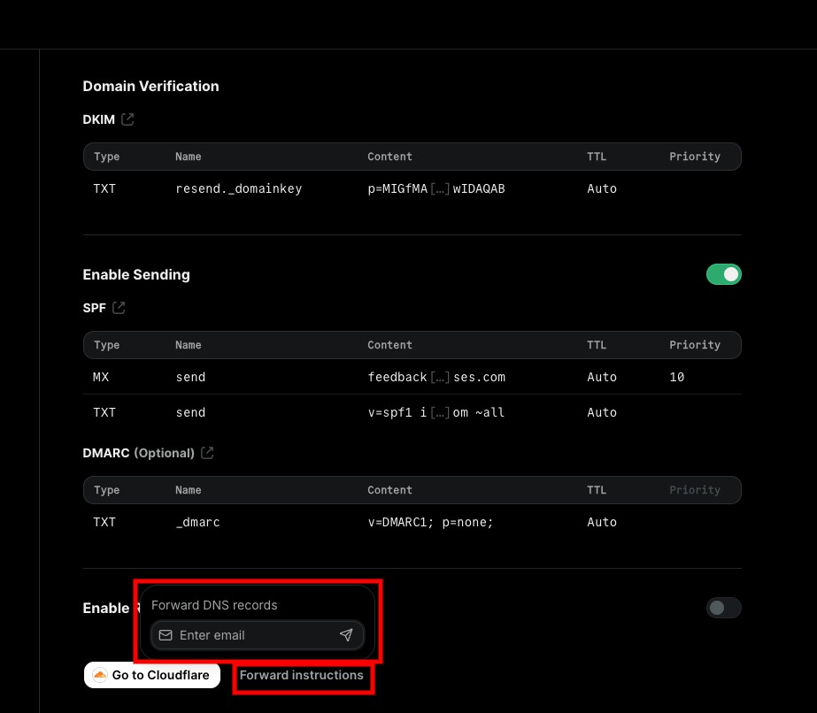<figcaption></figcaption></figure>

5. **Setelah anda lakukan penetapan seperti yang mereka inginkan pada DNS record domain anda** itu nanti, anda boleh klik pada "**Verify DNS Records**"

<figure>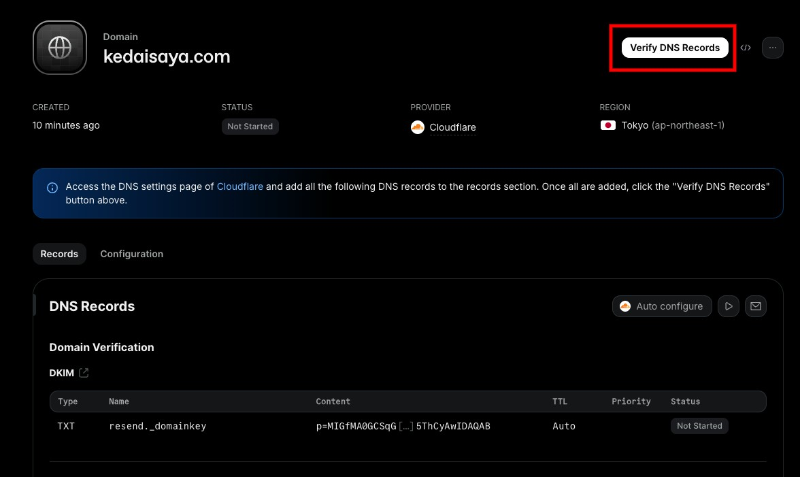<figcaption></figcaption></figure>

6. Kemudian, anda perlu **tunggu sehingga kesemua proses verification disemak oleh sistem mereka**.\
   \
   Sekiranya, penetapan anda semua sudah selesai dan tiada sebarang isu, anda akan dapat lihat paparan seperti di bawah

<figure>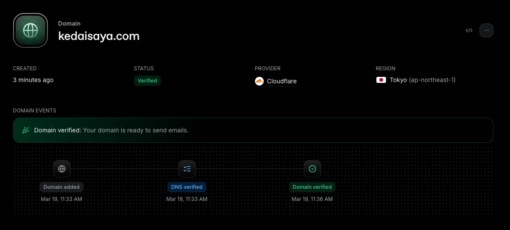<figcaption></figcaption></figure>

## Cipta API Key

1. Log masuk dashboard Resend

<figure><figcaption></figcaption></figure>

2. Klik pada tab **API Keys**

<figure>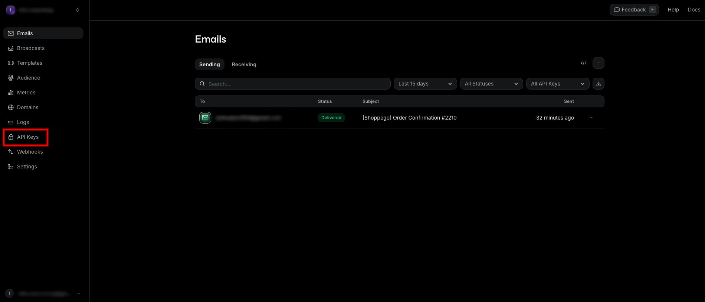<figcaption></figcaption></figure>

3. Klik **Create API Keys**

<figure>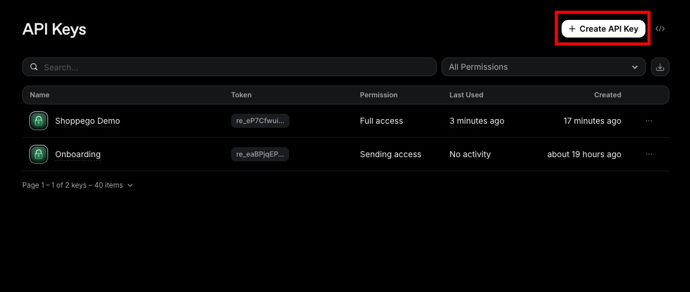<figcaption></figcaption></figure>

4. Nanti anda akan dapat lihat 1 popup:\
   \- Masukkan nama API Keys anda.\
   \- Kemudian, anda boleh tetapkan "Permission" kepada "Full access".\
   \- Untuk penetapan domain, anda boleh pilih sama ada ingin tetapkan pada 1 domain sahaja atau kesemua domain anda.\
   \
   Setelah selesai klik **Add**

<figure>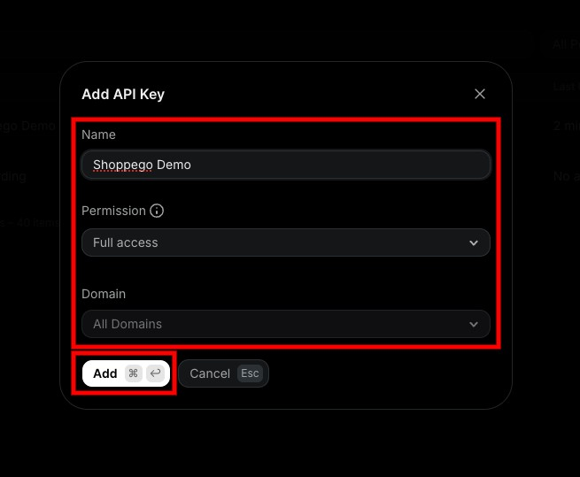<figcaption></figcaption></figure>

5. Kemudian, anda boleh **Copy dan simpan API key** anda itu untuk digunakan pada penetapan di dashboard Shoppego nanti.

<figure>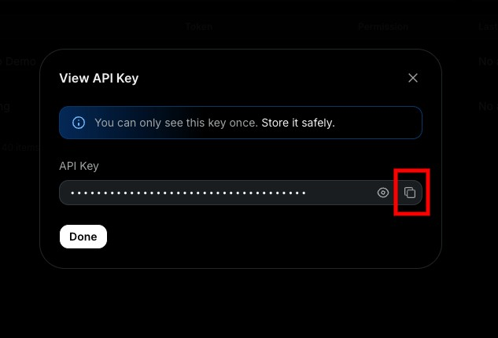<figcaption></figcaption></figure>

## Penetapan di Shoppego

1. Log masuk akaun Shoppego

<figure><figcaption></figcaption></figure>

2. Klik pada **Settings**

<figure><figcaption></figcaption></figure>

3. Klik pada **Transactional email providers**

<figure><figcaption></figcaption></figure>

4. Klik **Activate/Edit** pada tab **Resend**

<figure>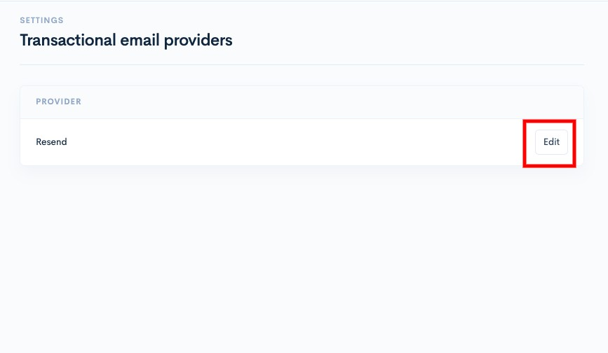<figcaption></figcaption></figure>

5. **Masukkan API key** anda dan **tick pada toggle Enable**. Kemudian, anda boleh **Save** penetapan itu.

<figure>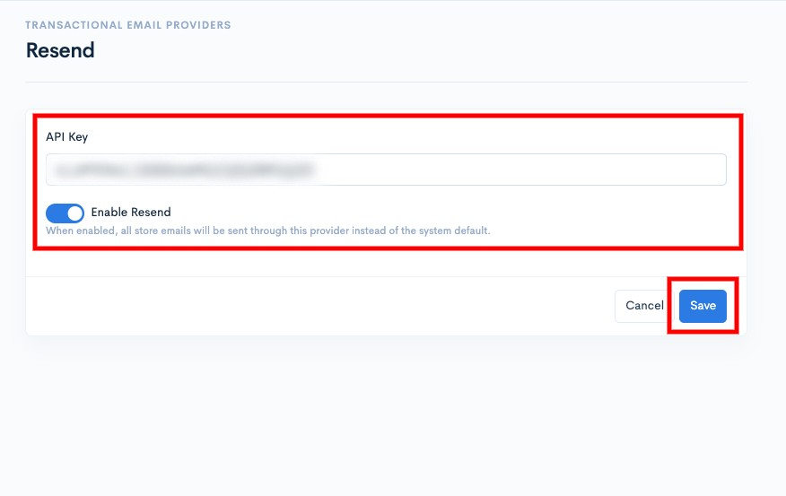<figcaption></figcaption></figure>

Kini penetapan integration anda telah selesai.

## Maklumat Tambahan

Pastikan anda telah masukkan email notification yang betul untuk penghantaran notifikasi email anda nanti.

Anda boleh semak penetapan itu pada bahagian:

1. Log masuk akaun Shoppego

<figure><figcaption></figcaption></figure>

2. Klik pada **Settings**

<figure><figcaption></figcaption></figure>

3. Klik pada **General**

<figure><figcaption></figcaption></figure>

4. Pastikan penetapan "**Notification & Reply-to Email**" ditetapkan kepada email yang **menggunakan domain di akaun Resend anda itu**.\
   \
   Sebagai contoh, di Resend anda menggunakan domain kedaisaya.com, jadi pada penetapan itu, anda perlu masukkan email seperti ini: <hello@kedaisaya.com>

<figure><figcaption></figcaption></figure>
