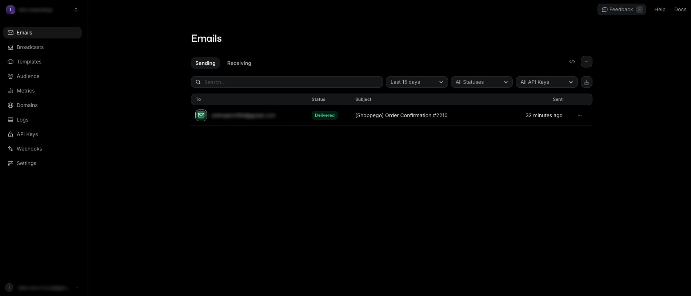
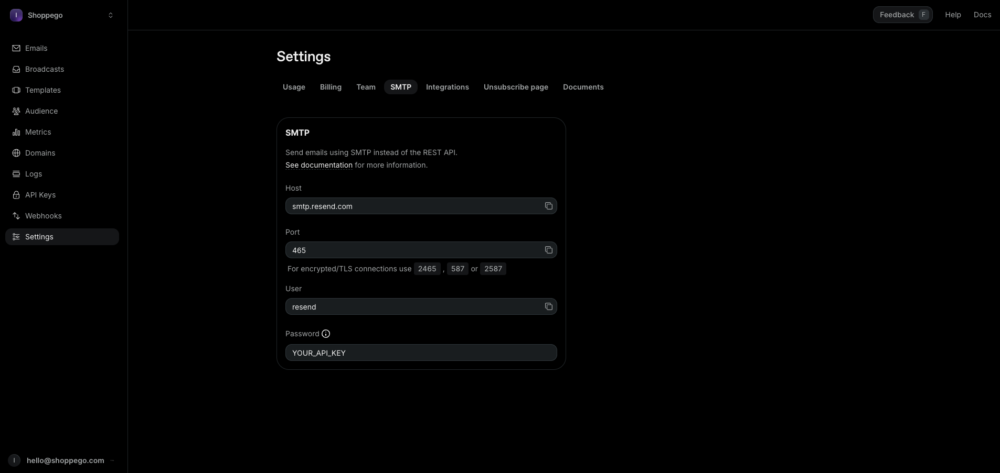
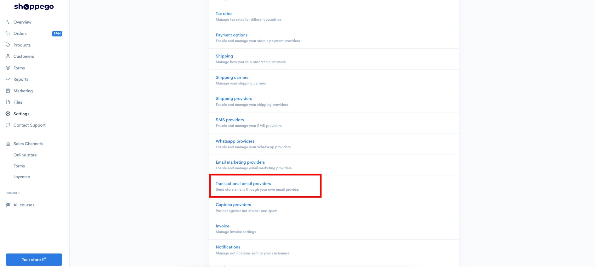
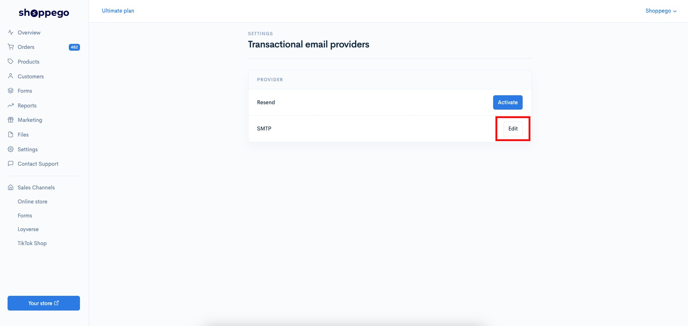
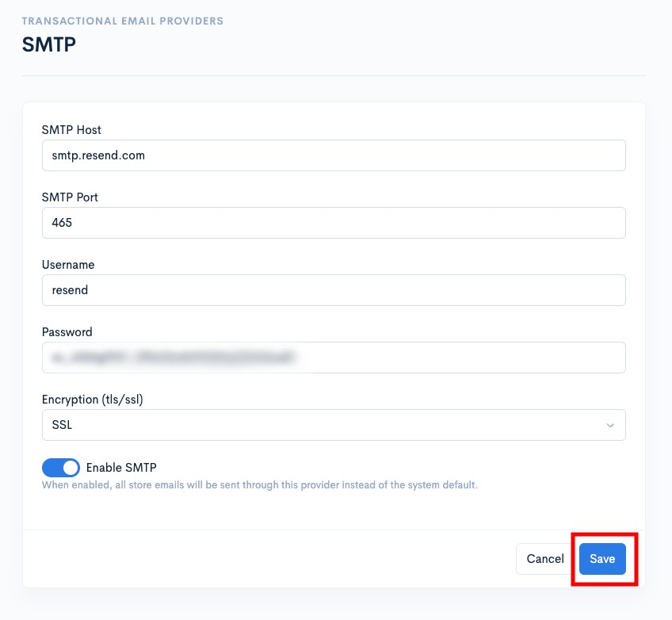
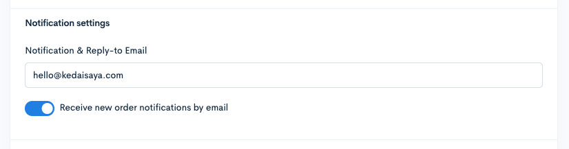

# SMTP

SMTP (Simple Mail Transfer Protocol) ialah protokol internet standard yang digunakan untuk menghantar dan menyampaikan e-mel keluar antara pelayan mel.

Untuk integration anda boleh rujuk tutorial yang disediakan ini.

## Sebelum Anda Memulakan:

* Pastikan anda sudah tetapkan akaun transactional email anda seperti penetapan domain/API key
* Pastikan akaun transactional email anda itu mempunyai maklumat integrasi SMTP

## Dapatkan maklumat SMTP

1. Log masuk akaun transactional email anda itu

<figure><figcaption></figcaption></figure>

2. Akses pada penetapan SMTP\
   \
   Kemudian, anda boleh gunakan kesemua maklumat-maklumat itu untuk dimasukkan pada penetapan di Shoppego nanti. Pastikan anda juga sudah lakukan kesemua penetapan yang diperlukan seperti verify domain/API key

<figure><figcaption></figcaption></figure>

## Penetapan di Shoppego

1. Log masuk akaun Shoppego

<figure><figcaption></figcaption></figure>

2. Klik pada **Settings**

<figure><figcaption></figcaption></figure>

3. Klik pada **Transactional email providers**

<figure><figcaption></figcaption></figure>

4. Klik **Activate/Edit** pada tab **SMTP**

<figure><figcaption></figcaption></figure>

5. **Masukkan kesemua maklumat** anda dan **tick pada toggle Enable**. Kemudian, anda boleh **Save** penetapan itu.

<figure><figcaption></figcaption></figure>

Kini penetapan integration anda telah selesai.

## Maklumat Tambahan

Pastikan anda telah masukkan email notification yang betul untuk penghantaran notifikasi email anda nanti.

Anda boleh semak penetapan itu pada bahagian:

1. Log masuk akaun Shoppego

<figure><figcaption></figcaption></figure>

2. Klik pada **Settings**

<figure><figcaption></figcaption></figure>

3. Klik pada **General**

<figure><figcaption></figcaption></figure>

4. Pastikan penetapan "**Notification & Reply-to Email**" ditetapkan kepada email yang **menggunakan domain di akaun transactional email anda itu**.\
   \
   Sebagai contoh, di akaun transactional email anda menggunakan domain kedaisaya.com, jadi pada penetapan itu, anda perlu masukkan email seperti ini: <hello@kedaisaya.com>

<figure><figcaption></figcaption></figure>
