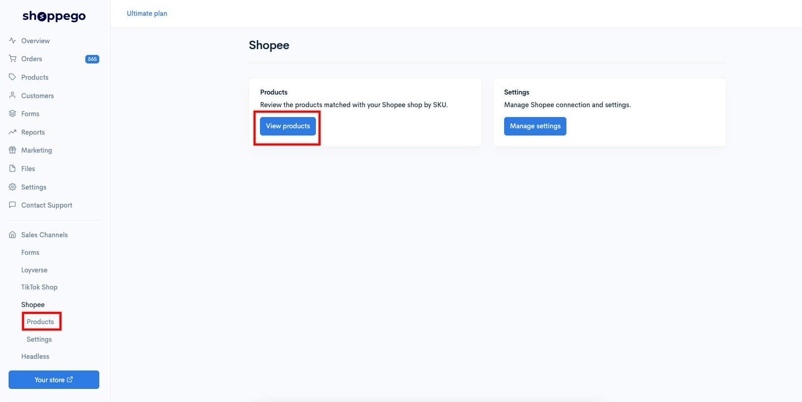
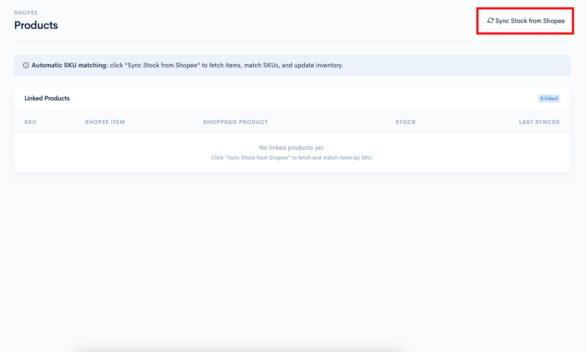
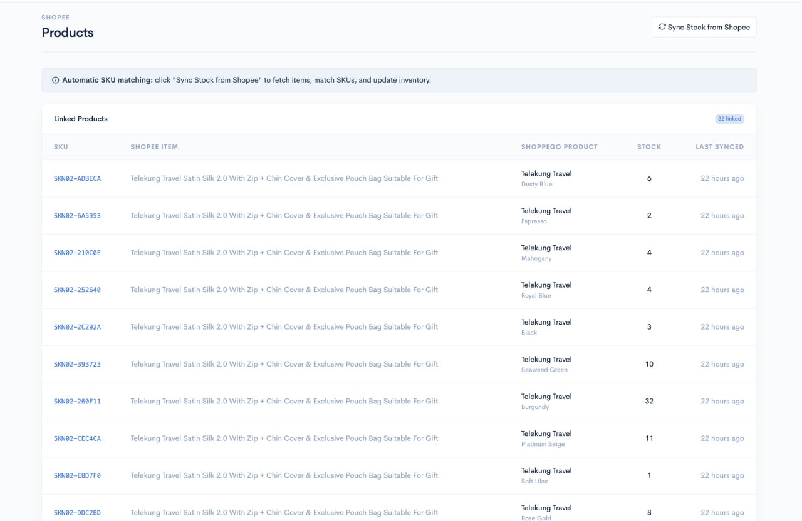

# Products

Untuk selaraskan produk anda di website Shoppego dan di Shopee Seller, anda boleh pergi pada bahagian:

1. Log masuk akaun Shoppego

<figure><figcaption></figcaption></figure>

2. Klik pada **Sales Channels**

<figure><figcaption></figcaption></figure>

3. Klik pada **Shopee**

<figure><figcaption></figcaption></figure>

4. Klik pada **Products**

<figure><figcaption></figcaption></figure>

5. Kemudian, anda boleh klik pada butang "**Sync Stock from Shopee**" untuk selaraskan produk anda di Shopee itu dengan produk anda di store Shoppego melalui bacaan SKU.

<figure><figcaption></figcaption></figure>

Kini penetapan selaraskan stok itu sudah selesai

<figure><figcaption></figcaption></figure>

## Maklumat Tambahan

Sekiranya anda **ada melakukan perubahan stok secara manual di platform Shopee**, anda perlu **klik semula button "Sync Stock from Shopee"** itu untuk **selaraskan semula stok** produk tersebut.

**Penyegerakan stok automatik hanya berfungsi apabila SKU dalam Shoppego sama dengan SKU dalam Shopee**. Jika SKU tersebut berbeza, Shoppego tidak akan dapat menyegerakkan stok produk berkenaan.

**Shoppego harus menjadi sumber utama inventori anda**. Kami mengesyorkan agar anda mengemas kini stok produk hanya di Shoppego. Elakkan daripada mengemas kini stok pada kedua-dua Shoppego dan Shopee, kerana tindakan ini boleh menyebabkan ketidakseragaman data stok.

Jika anda mengalami sebarang ralat di platform Shopee Seller anda boleh hubungi sistem sokongan mereka untuk mendapatkan bantuan.
