# TikTok Shop

TikTok ialah platform media sosial perkongsian video. Anda boleh menggunakan fungsi integrasi dengan TikTok Shop untuk selaraskan penolakan produk anda ke TikTok Shop. **Perlu dimaklumkan sistem hanya akan selaraskan stok produk untuk:**

* **Perubahan stok dari platform Shoppego**
* **Perubahan stok melalui pembelian di platform Shoppego**
* **Perubahan stok melalui pembelian di platform TikTok Shop**
* **Perubahan stok melalui proses cancel/refund di platform TikTok Shop**

**Fungsi penyelerasan stok antara platform Shoppego dan TikTok Shop juga akan berpandukan penetapan SKU pada produk/variants produk itu sendiri.**


Fungsi ini hanya terdapat untuk langganan plan **Ultimate** sahaja.


## Pendaftaran akaun TikTok Shop

Sekiranya anda masih belum mempunyai akaun TikTok Shop, anda boleh daftar melalui link ini terlebih dahulu: <https://seller-my.tiktok.com/account/register>

## Format Produk Untuk TikTok Shop

Setelah anda log masuk kedalam dashboard akaun TikTok Shop, anda boleh lakukan penambahan produk anda di TikTok Shop seperti biasa.

Anda perlu pastikan setiap variants anda itu mempunyai SKU yang unik untuk proses sync dengan store Shoppego anda nanti.

<figure>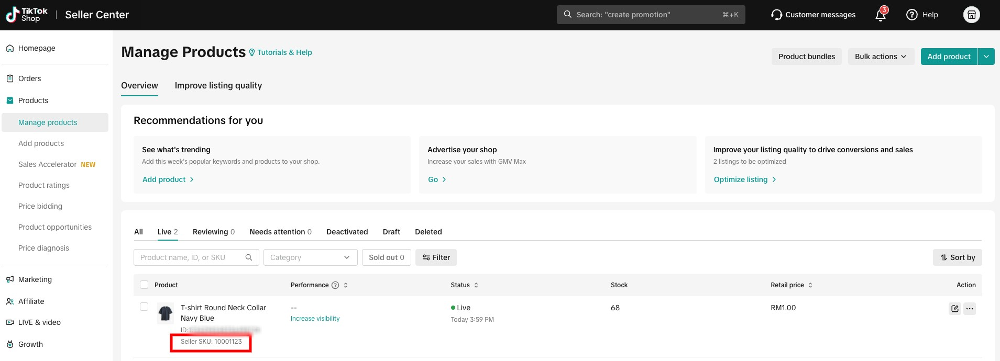<figcaption></figcaption></figure>

## Format Produk Untuk Shoppego

Anda perlu pastikan setiap produk anda di Shoppego yang anda ingin selaraskan stok dengan platform TikTok Shop mempunyai SKU yang sama seperti produk di TikTok Shop anda.

Untuk penetapan SKU di platform Shoppego, anda boleh pergi pada bahagian:

1. Log masuk akaun Shoppego

<figure><figcaption></figcaption></figure>

2. Klik pada **Products**

<figure>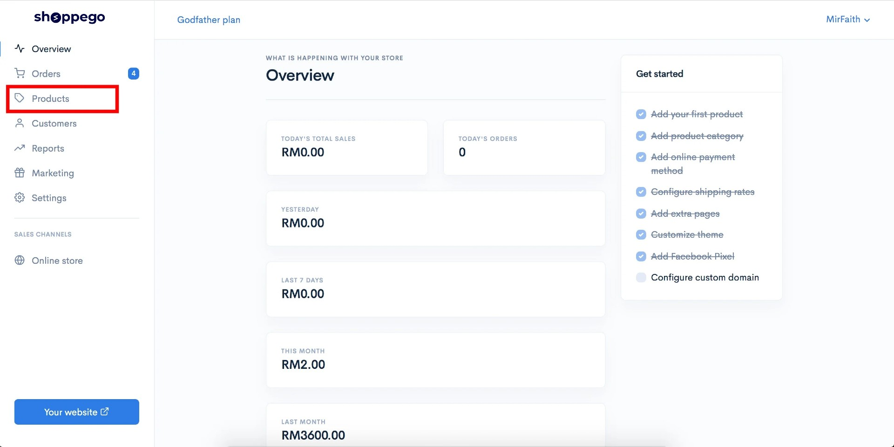<figcaption></figcaption></figure>

3. Klik pada produk yang anda ingin selaraskan stok itu atau anda boleh sahaja cipta produk yang baru.

<figure>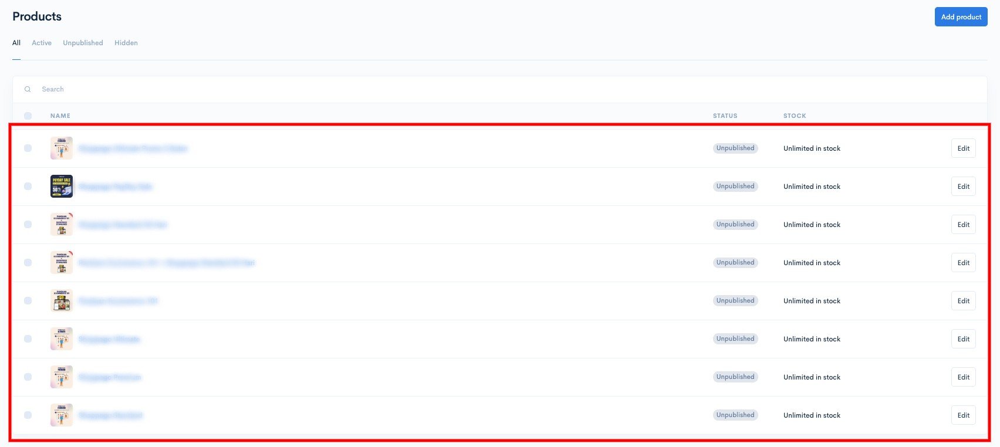<figcaption></figcaption></figure>

4. Anda boleh pergi pada tab **Variants**

<figure>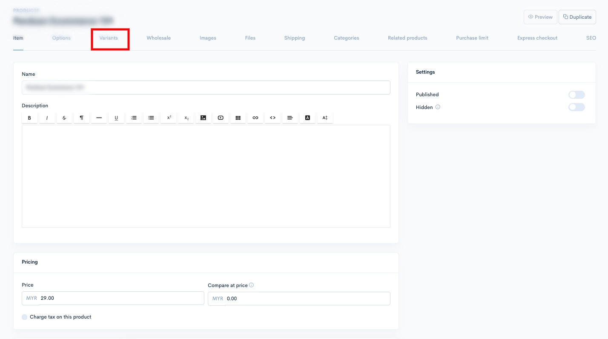<figcaption></figcaption></figure>

5. Klik pada tab pemilihan variants yang anda ingin lakukan penambahan penetapan SKU untuk selaraskan stok.

<figure>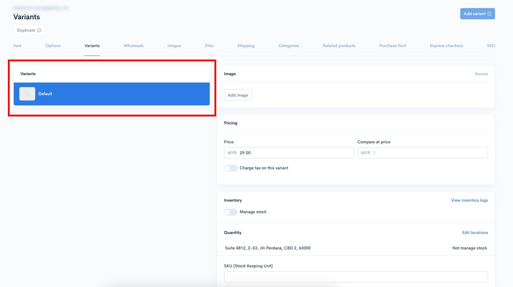<figcaption></figcaption></figure>

6. Kemudian, anda **boleh masukkan penetapan SKU yang sama seperti produk anda di TikTok Shop itu pada penetapan "SKU (Stock Keeping Unit)" di platform Shoppego** dan klik **Save**

<figure>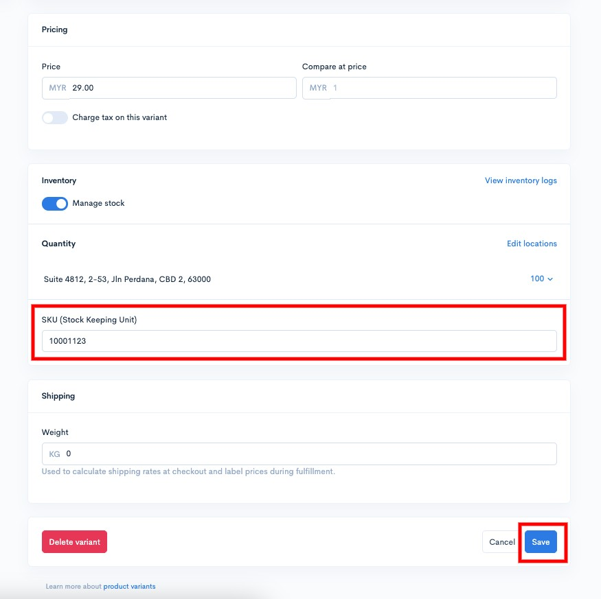<figcaption></figcaption></figure>

## Penetapan TikTok Shop di Shoppego

1. Log masuk akaun Shoppego anda

<figure><figcaption></figcaption></figure>

2. Klik pada **Sales channels**

<figure>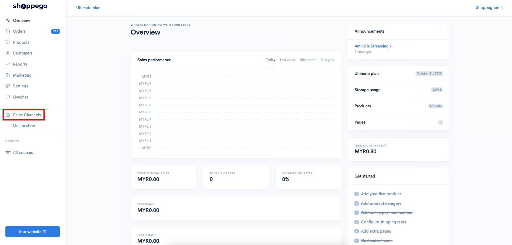<figcaption></figcaption></figure>

3. Klik pada "**Install**" pada **TikTok Shop**

<figure>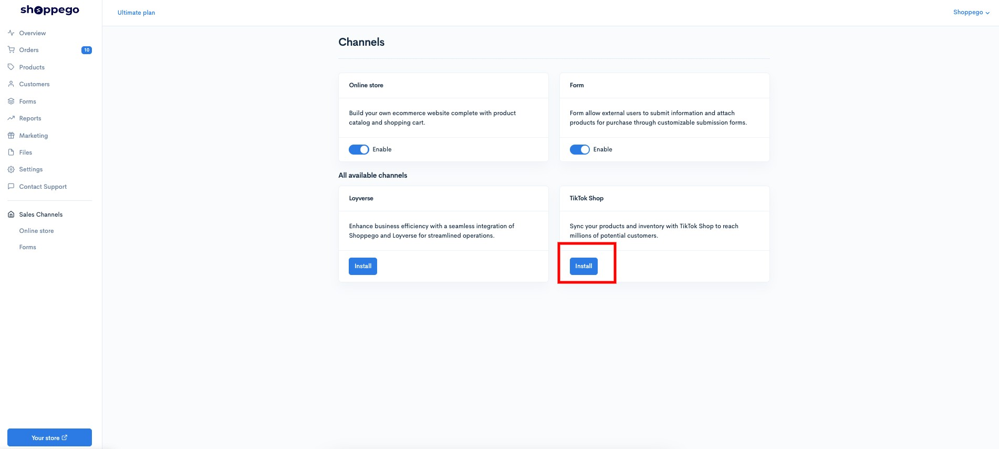<figcaption></figcaption></figure>

4. Kemudian, anda akan diminta untuk log masuk kedalam akaun TikTok Shop anda. Setelah, anda log masuk, anda boleh klik pada "**Confirm Install**"

<figure>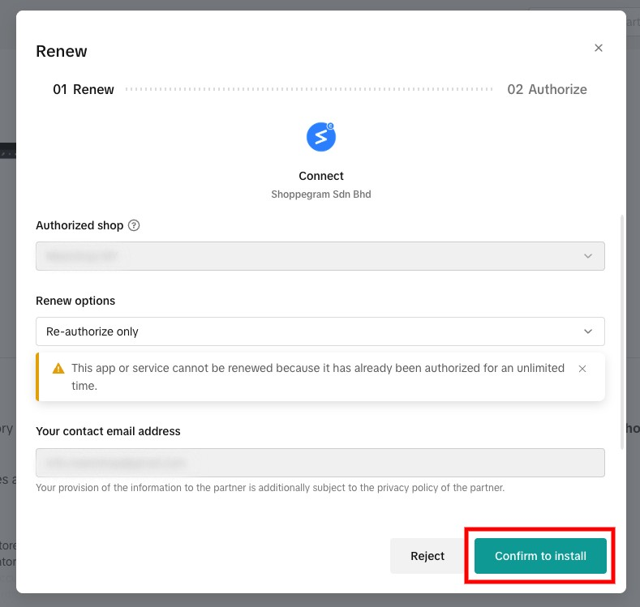<figcaption></figcaption></figure>

5. Anda akan diminta untuk tick pada polisi yang ditetapkan dan anda boleh klik **Authorize**

<figure>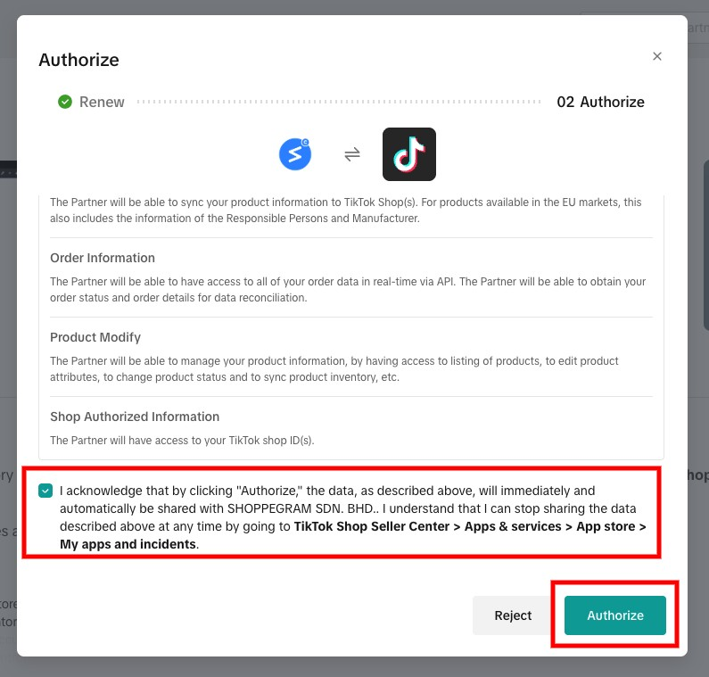<figcaption></figcaption></figure>

Kini, store Shoppego anda sudah berhubung dengan akaun TikTok Shop anda.

<figure>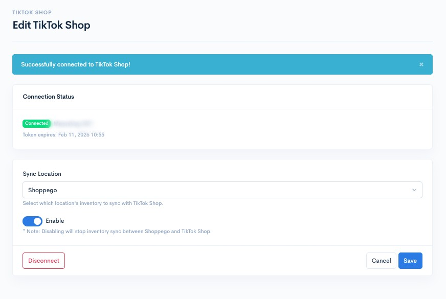<figcaption></figcaption></figure>

Seterusnya, anda boleh lakukan penetapan untuk selaraskan stok, anda boleh rujuk pada bahagian:


[Products](tiktok-shop/products.md)


Untuk anda lakukan penetapan integrasi TikTok Shop semula atau perubahan lokasi penyelerasan stok, anda boleh rujuk pada bahagian:


[Settings](tiktok-shop/settings.md)

