# Woocommerce

Woocomerce ialah ialah pemalam e-dagang sumber terbuka percuma yang direka untuk mengubah mana-mana laman web WordPress standard menjadi kedai dalam talian yang berfungsi sepenuhnya. Anda boleh menggunakan fungsi integrasi dengan Woocommerce untuk selaraskan penolakan produk anda ke Woocommerce. **Perlu dimaklumkan sistem hanya akan selaraskan stok produk untuk:**

* **Perubahan stok dari platform Shoppego**
* **Perubahan stok melalui pembelian di platform Shoppego**
* **Perubahan stok melalui pembelian di platform Woocommerce**

**Fungsi penyelerasan stok antara platform Shoppego dan Woocommerce juga akan berpandukan penetapan SKU pada produk/variants produk itu sendiri.**


Fungsi ini hanya terdapat untuk langganan plan **Ultimate** sahaja.


## Pendaftaran akaun Wordpress

Sekiranya anda masih belum mempunyai akaun Wordpress untuk proses penetapan plugin Woocommerce, anda boleh daftar melalui link ini terlebih dahulu: [https://wordpress.com/setup/onboarding/user?start\_ref=https%3A%2F%2Fwordpress.com%2F](https://wordpress.com/setup/onboarding/user?start_ref=https%3A%2F%2Fwordpress.com%2F)

## Format Produk Untuk Woocommerce

Setelah anda log masuk kedalam dashboard akaun Wordpress, anda boleh lakukan penambahan produk anda di Woocommerce seperti biasa.

Anda perlu pastikan setiap variants anda itu mempunyai SKU yang unik untuk proses sync dengan store Shoppego anda nanti.

<figure>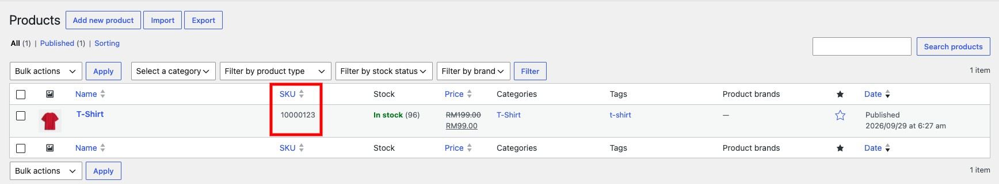<figcaption></figcaption></figure>

## Format Produk Untuk Shoppego

Anda perlu pastikan setiap produk anda di Shoppego yang anda ingin selaraskan stok dengan platform Woocommerce mempunyai SKU yang sama seperti produk di Woocommerce anda.

Untuk penetapan SKU di platform Shoppego, anda boleh pergi pada bahagian:

1. Log masuk akaun Shoppego

<figure>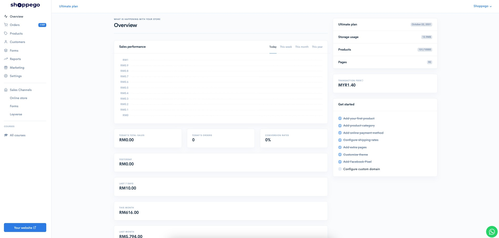<figcaption></figcaption></figure>

2. Klik pada **Products**

<figure>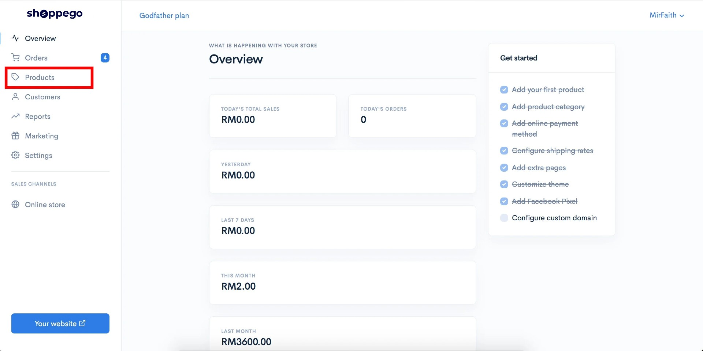<figcaption></figcaption></figure>

3. Klik pada produk yang anda ingin selaraskan stok itu atau anda boleh sahaja cipta produk yang baru.

<figure>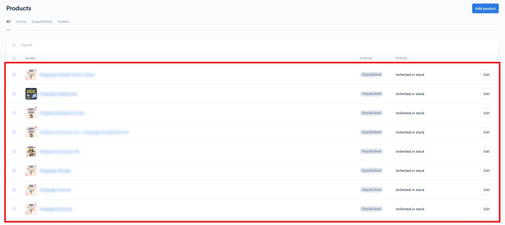<figcaption></figcaption></figure>

4. Anda boleh pergi pada tab **Variants**

<figure>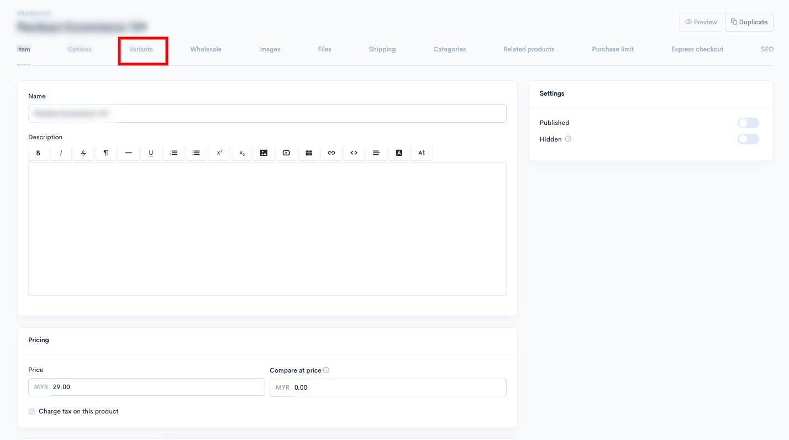<figcaption></figcaption></figure>

5. Klik pada tab pemilihan variants yang anda ingin lakukan penambahan penetapan SKU untuk selaraskan stok.

<figure>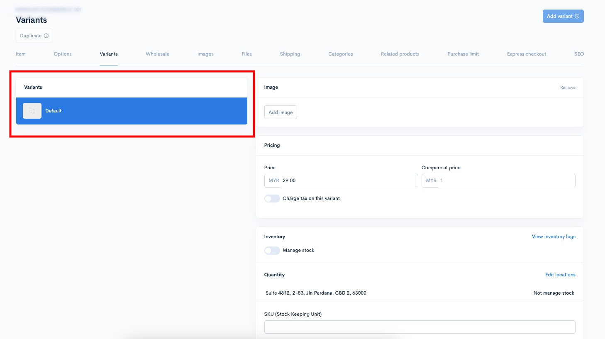<figcaption></figcaption></figure>

6. Kemudian, anda **boleh masukkan penetapan SKU yang sama seperti produk anda di Woocommerce itu pada penetapan "SKU (Stock Keeping Unit)" di platform Shoppego** dan klik **Save**

<figure>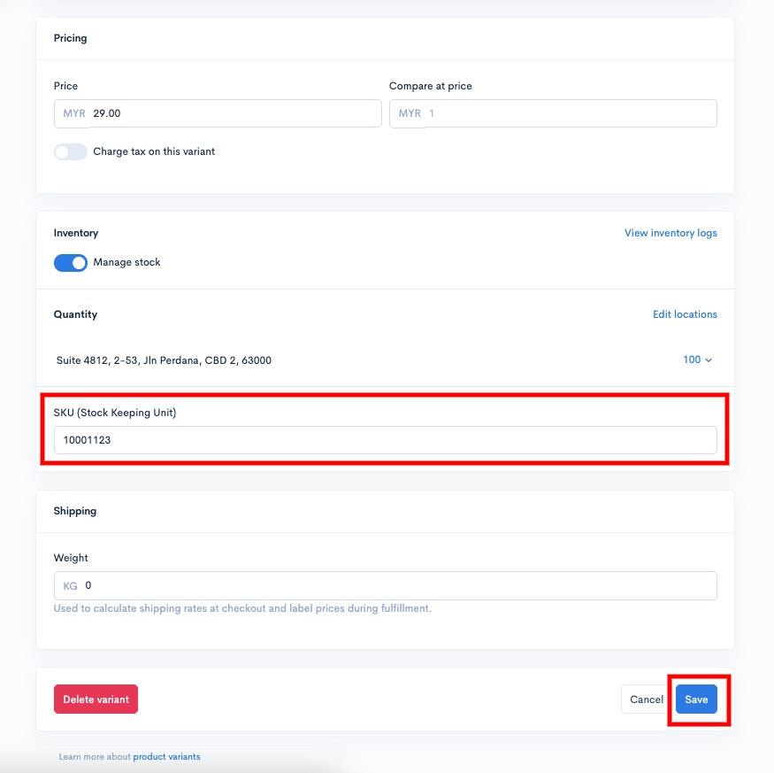<figcaption></figcaption></figure>

## Penetapan Woocommerce di Shoppego

1. Log masuk akaun Shoppego anda

<figure><figcaption></figcaption></figure>

2. Klik pada **Sales channels**

<figure>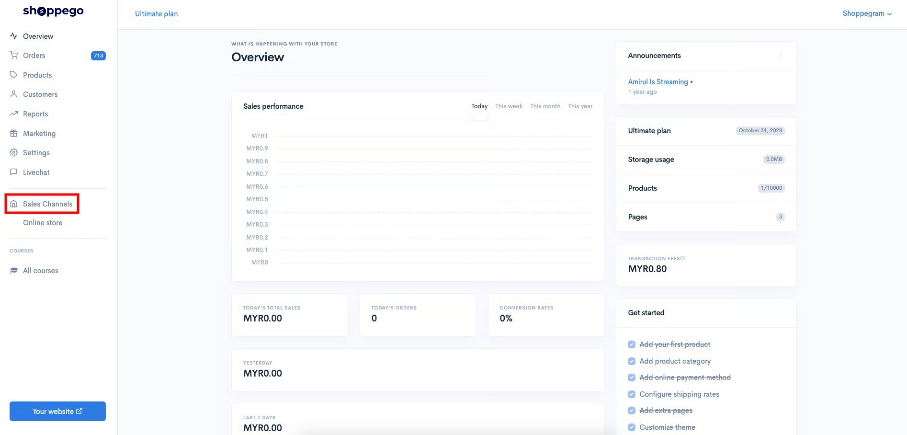<figcaption></figcaption></figure>

3. Klik pada "**Manage sites**" pada **Woocommerce**

<figure>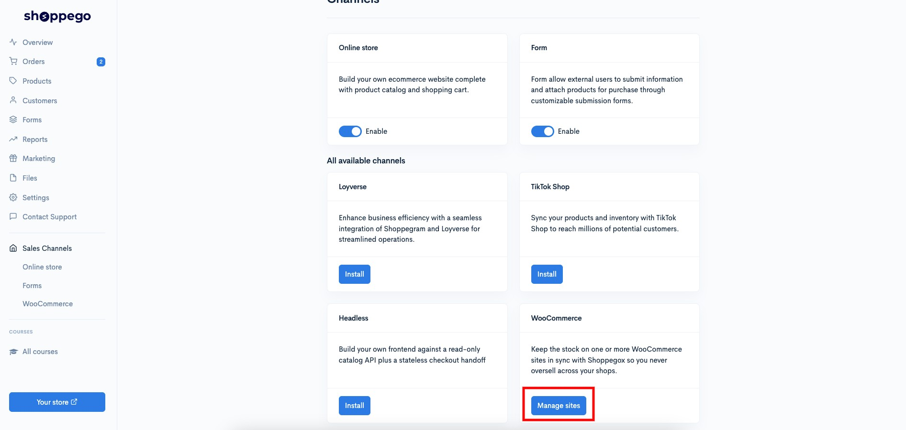<figcaption></figcaption></figure>

4. Kemudian, anda boleh masukkan URL/Link website Woocommerce anda itu pada ruang penetapan "**Site address**" dan klik "**Connect site**"

<figure>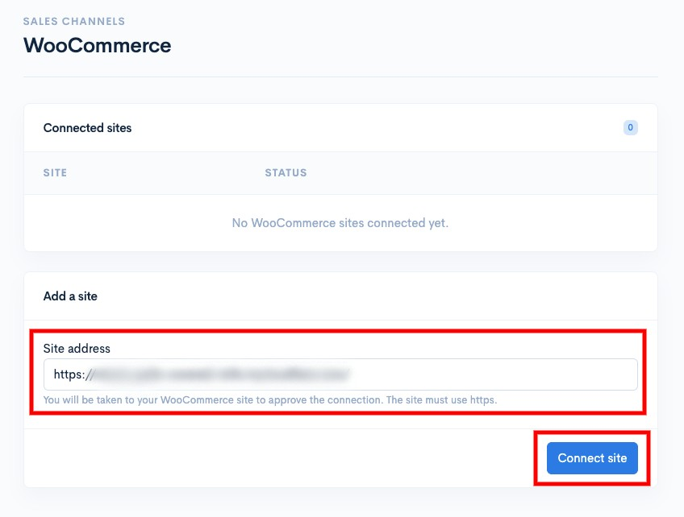<figcaption></figcaption></figure>

Nanti, anda akan diminta untuk "**Approve**" penetapan integrasi tersebut. Sekiranya, anda masih belum log masuk akaun Woocommerce, anda mungkin akan diminta untuk log masuk terlebih dahulu.

<figure>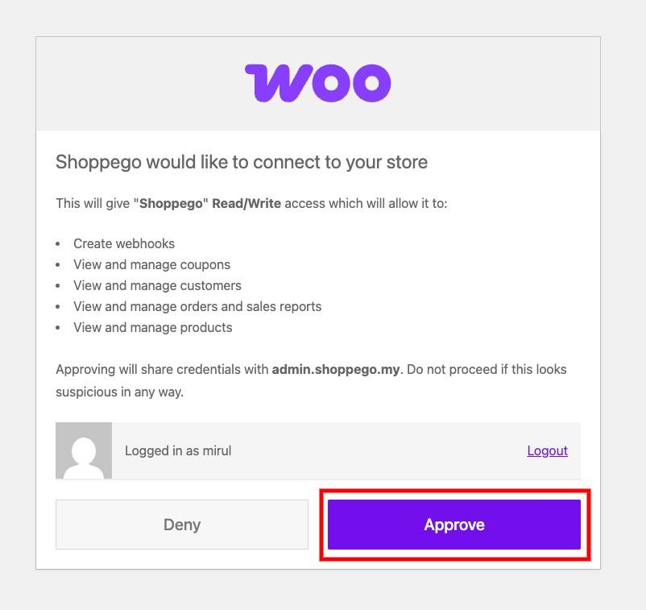<figcaption></figcaption></figure>

Kini, store Shoppego anda sudah berhubung dengan akaun Woocommerce anda.

<figure>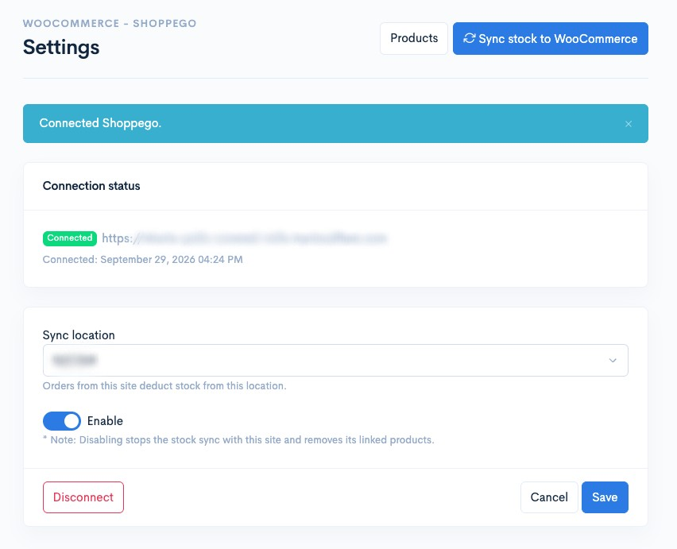<figcaption></figcaption></figure>

Seterusnya, anda boleh lakukan penetapan untuk selaraskan stok, anda boleh rujuk pada bahagian:


[products.md](../shopee/products.md)


Untuk anda lakukan penetapan integrasi Woocommerce semula atau perubahan lokasi penyelerasan stok, anda boleh rujuk pada bahagian:


[settings.md](../shopee/settings.md)


## Info Tambahan

Untuk integrasi Woocommerce, anda boleh lakukan penambahan sites lebih dari satu. Anda boleh lakukan penambahan dengan cara masukkan sahaja link website Woocommerce anda itu dan klik "**Connect site**"

<figure>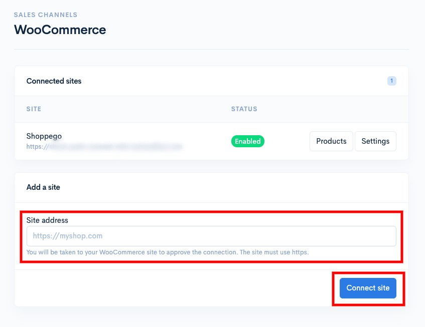<figcaption></figcaption></figure>
