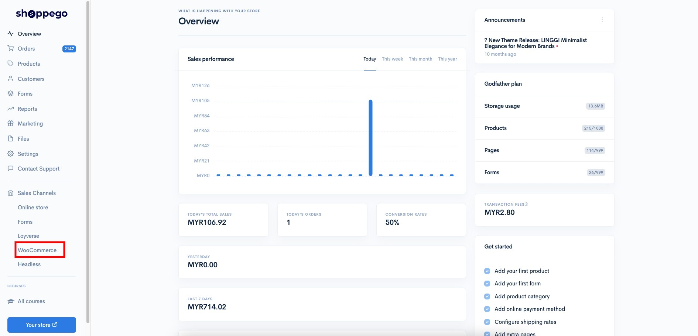
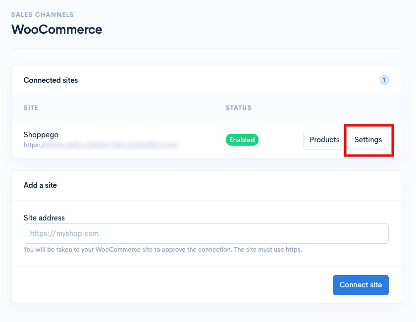
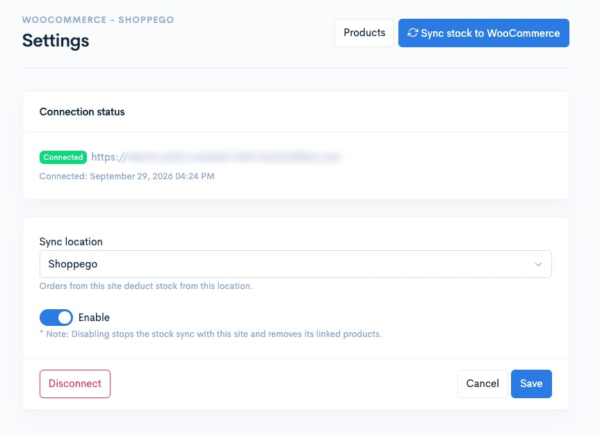
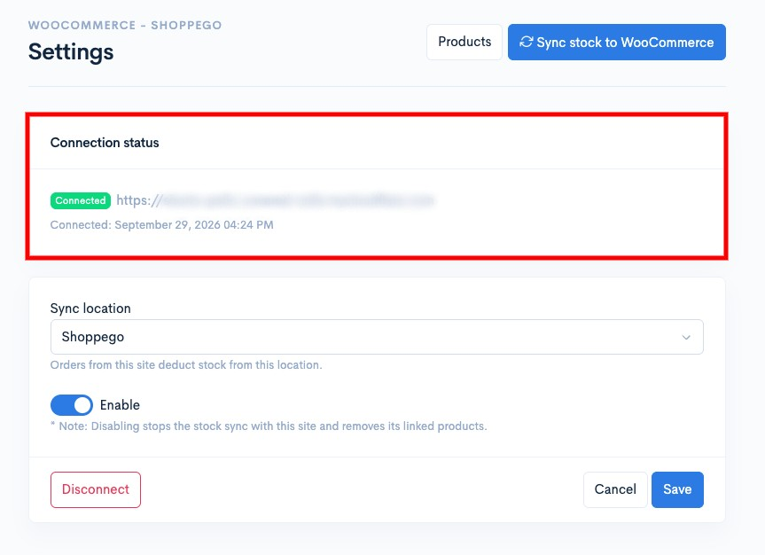
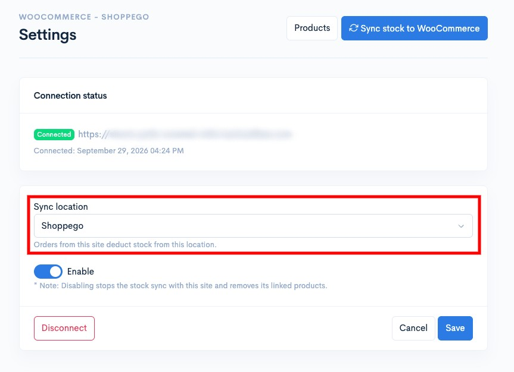
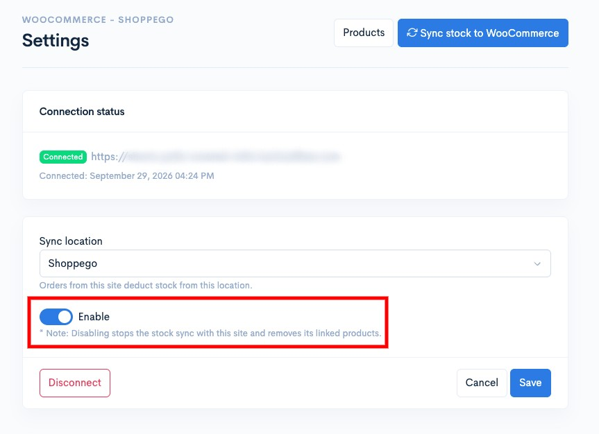
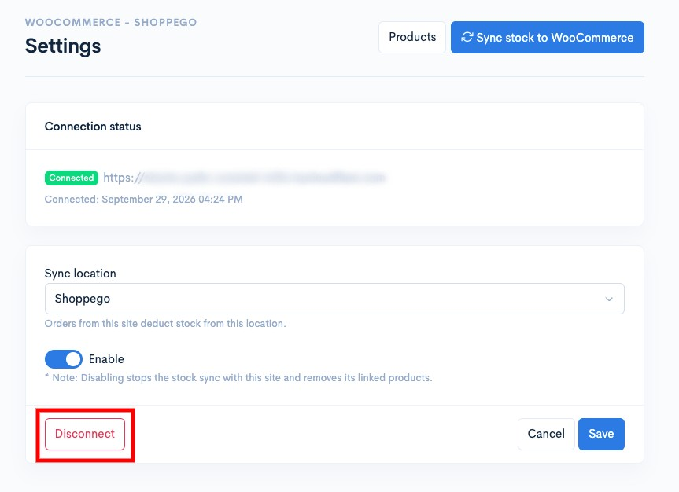
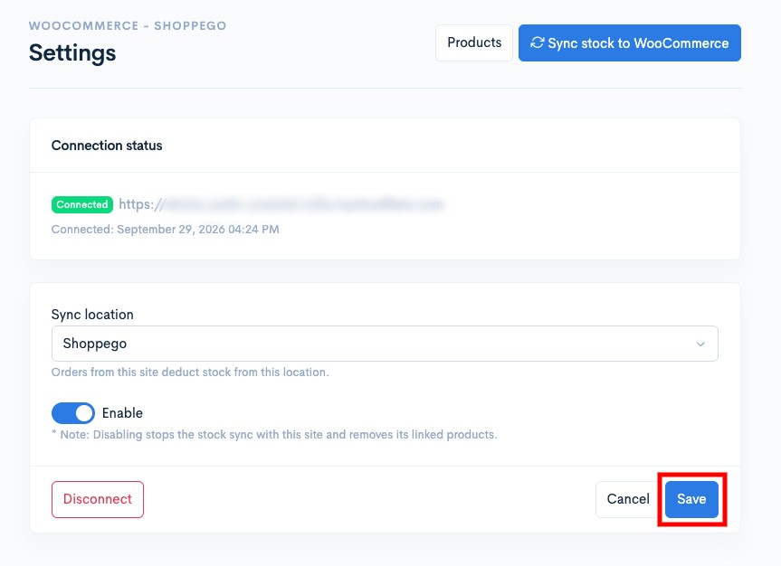

# Settings

Untuk anda lakukan perubahan penetapan integrasi Woocommerce, samaada penetapan lokasi atau akaun Woocommerce, anda boleh pergi pada bahagian:

1. Log masuk akaun Shoppego

<figure><figcaption></figcaption></figure>

2. Klik pada **Sales Channels**

<figure><figcaption></figcaption></figure>

3. Klik pada **Woocommerce**

<figure><figcaption></figcaption></figure>

4. Klik pada **Settings**

<figure><figcaption></figcaption></figure>

Didalam halaman ini nanti, terdapat beberapa penetapan dan info yang anda dapat lihat, antaranya:

<figure><figcaption></figcaption></figure>

### Lihat info integrasi akaun Woocommerce

<figure><figcaption></figcaption></figure>

### Lakukan perubahan lokasi untuk selaraskan stok

<figure><figcaption></figcaption></figure>

### Nyah-aktifkan integrasi Woocommerce

<figure><figcaption></figcaption></figure>

### Mengeluarkan integrasi akaun Woocommerce

<figure><figcaption></figcaption></figure>

Pastikan bagi setiap perubahan yang anda lakukan, anda klik pada butang **Save** untuk simpan penetapan tersebut.

<figure><figcaption></figcaption></figure>
